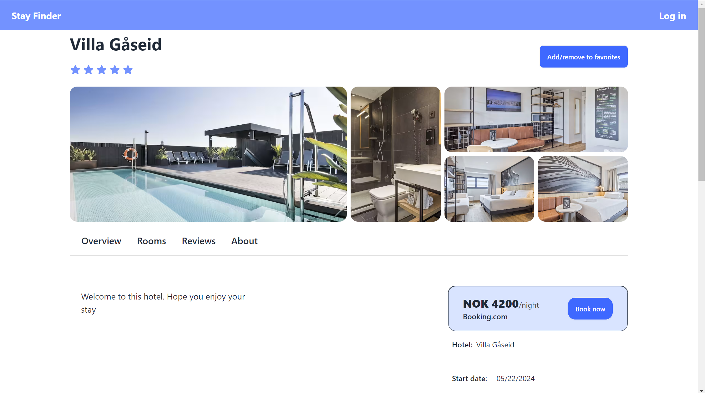

# Webapp_group3 Backend
This is our exam project in the courses: **IDATA2301 Web Technologies** and
**IDATA2306 Application Development** at NTNU Ålesund.

## Table of Contents

- [Installation](#installation)
- [Library's and frameworks](#Library's-and-frameworks)
- [Usage](#usage)


## Installation

1. **Clone the repository**

   ```bash
   git clone https://github.com/Hardingendaniel/webapp_group3
   cd ./frontend

2. **Install dependencies**

   Make sure you have Node.js installed. Then run:
   ```bash
   npm install
3. **Start the development server**

   ```bash
   npm start

## Library's and frameworks
The frontend part of this
- **React:** Library for web and native user interfaces
- **Tailwind CSS:** CSS framework
- **daisyUI:** Component library for Tailwind CSS

## Usage
Our website allows users to check out different hotels around Norway and book them or add them to their
favorite list. Users can also create accounts and logg in with them.

Front page:


Browsing page:


Hotel page:
